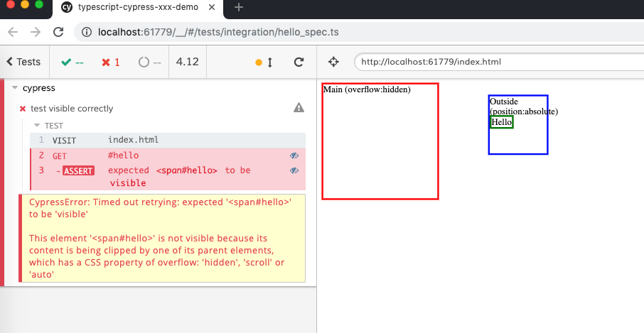

TypeScript Cypress Check Visibility Issue Demo
==========================================

Cypress `.should('be.visible')` has issues to detect visibility.

```
npm install

npm run test:run
```

Then choose the "hello_spec.ts".


